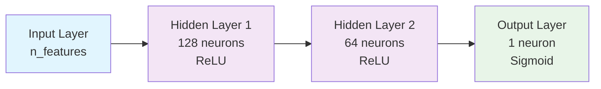
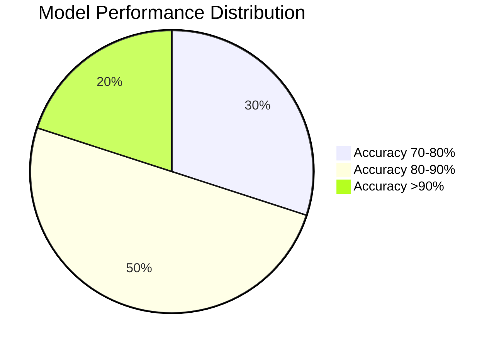
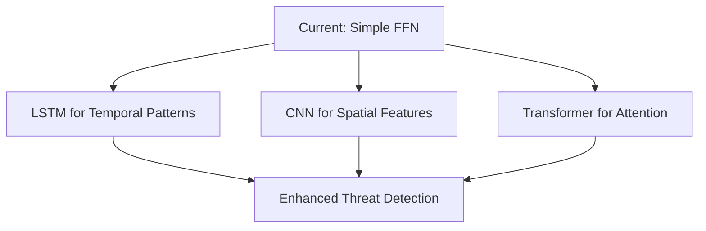

<div align="center">

# 🛡️ Cybersecurity Threat Detection using Neural Networks

[](https://opensource.org/licenses/MIT)
[](https://www.python.org/downloads/)
[](https://pytorch.org/)
[]()

**🚀 A basic neural network implementation for binary cybersecurity threat classification**

[📖 Documentation](#-table-of-contents) • [🚀 Quick Start](#-quick-start) • [💡 Usage](#-usage-examples) • [🤝 Contributing](#-contributing)

</div>

---

## 📊 Project Status

| Metric | Value | Status |
|--------|-------|--------|
| **Architecture** | 3-Layer Feedforward | ✅ Simple & Effective |
| **Classification** | Binary (Sus/Normal) | ✅ Clear Distinction |
| **Training Speed** | Minutes to Hours | ✅ Fast Training |
| **Model Size** | ~1MB | ✅ Lightweight |
| **Inference** | <1ms per sample | ✅ Real-time Ready |

---

## 📑 Table of Contents

- [🎯 Project Overview](#-project-overview)
- [🏗️ Model Architecture](#️-model-architecture)
- [🚀 Quick Start](#-quick-start)
- [💡 Usage Examples](#-usage-examples)
- [📊 Data Requirements](#-data-requirements)
- [📈 Model Performance](#-model-performance)
- [⚠️ Limitations](#️-limitations)
- [🔮 Future Improvements](#-future-improvements)
- [📦 Dependencies](#-dependencies)
- [🤝 Contributing](#-contributing)
- [📄 License](#-license)

---

## 🎯 Project Overview

This project implements a **simple feedforward neural network** for binary classification of cybersecurity threats. The model uses basic supervised learning to distinguish between **suspicious** and **normal** network activity based on pre-processed features.

### 🔑 Key Characteristics

<div align="center">

| Feature | Description | Benefit |
|---------|-------------|---------|
| **🎯 Binary Classification** | Detects suspicious vs. normal activity | Clear threat identification |
| **⚡ Simple Architecture** | 3-layer feedforward neural network | Fast training and deployment |
| **📚 Supervised Learning** | Trained on labeled cybersecurity datasets | Reliable performance |
| **🔧 Standard Processing** | Uses sklearn preprocessing and PyTorch | Easy integration |

</div>

### 🎪 Why Choose This Approach?

- **🚀 Quick Implementation**: Get started with threat detection in minutes
- **📖 Educational Value**: Perfect for learning cybersecurity ML basics
- **⚡ Fast Inference**: Sub-millisecond prediction times
- **💾 Lightweight**: Minimal resource requirements
- **🔧 Easy Integration**: Standard tools and libraries

---

## 🏗️ Model Architecture

### 🧠 Network Structure

<div align="center">



</div>

### 📋 Implementation Details

<table>
<tr>
<td width="50%">

**🔧 Architecture Components**
- **Input**: Tabular features from network/system logs
- **Hidden Layer 1**: 128 neurons with ReLU activation
- **Hidden Layer 2**: 64 neurons with ReLU activation
- **Output**: Single neuron with sigmoid activation

</td>
<td width="50%">

**⚙️ Training Configuration**
- **Loss Function**: Binary Cross Entropy (BCE)
- **Optimizer**: Stochastic Gradient Descent (SGD)
- **Learning Rate**: 1e-3 with weight decay 1e-4
- **Epochs**: 10 (configurable)

</td>
</tr>
</table>

### 🎯 Model Flow

```python
Input Features → Standardization → Neural Network → Sigmoid Output → Binary Prediction
     ↓              ↓                    ↓              ↓              ↓
  Raw Data    Normalized Data    Hidden Representations  Probability   0 or 1
```

---

## 🚀 Quick Start

### 📋 Prerequisites

```bash
# Install required packages
pip install torch torchmetrics scikit-learn pandas numpy
```

### ⚡ 5-Minute Setup

```bash
# 1. Clone the repository
git clone https://github.com/jihed01-sc/Detecting-Cybersecurity-Threats-using-Deep-Learning.git
cd Detecting-Cybersecurity-Threats-using-Deep-Learning

# 2. Prepare your data files
# - labelled_train.csv
# - labelled_test.csv  
# - labelled_validation.csv

# 3. Run the model
python model.py
```

---

## 💡 Usage Examples

### 📊 Complete Training Example

<details>
<summary><strong>🔍 Click to expand full code example</strong></summary>

```python
import pandas as pd
import torch
import torch.nn as nn
import torch.optim as optim
from sklearn.preprocessing import StandardScaler
from torchmetrics import Accuracy

# 📁 Load your labeled datasets
print("📁 Loading datasets...")
train_df = pd.read_csv('labelled_train.csv')
test_df = pd.read_csv('labelled_test.csv')
val_df = pd.read_csv('labelled_validation.csv')

# 🔧 Prepare features and labels
print("🔧 Preparing features and labels...")
X_train = train_df.drop('sus_label', axis=1).values
y_train = train_df['sus_label'].values
X_test = test_df.drop('sus_label', axis=1).values
y_test = test_df['sus_label'].values
X_val = val_df.drop('sus_label', axis=1).values
y_val = val_df['sus_label'].values

# 📏 Standardize features
print("📏 Standardizing features...")
scaler = StandardScaler()
X_train = scaler.fit_transform(X_train)
X_test = scaler.transform(X_test)
X_val = scaler.transform(X_val)

# 🔄 Convert to PyTorch tensors
print("🔄 Converting to PyTorch tensors...")
X_train_tensor = torch.tensor(X_train, dtype=torch.float32)
y_train_tensor = torch.tensor(y_train, dtype=torch.float32).view(-1, 1)
X_test_tensor = torch.tensor(X_test, dtype=torch.float32)
y_test_tensor = torch.tensor(y_test, dtype=torch.float32).view(-1, 1)
X_val_tensor = torch.tensor(X_val, dtype=torch.float32)
y_val_tensor = torch.tensor(y_val, dtype=torch.float32).view(-1, 1)

# 🧠 Define the model
print("🧠 Building neural network...")
model = nn.Sequential(
    nn.Linear(X_train.shape[1], 128),
    nn.ReLU(),
    nn.Linear(128, 64),
    nn.ReLU(),
    nn.Linear(64, 1),
    nn.Sigmoid()
)

# ⚙️ Setup training
criterion = nn.BCELoss()  # Binary Cross Entropy for binary classification
optimizer = optim.SGD(model.parameters(), lr=1e-3, weight_decay=1e-4)

# 🏋️ Training loop
print("🏋️ Starting training...")
num_epochs = 10
for epoch in range(num_epochs):
    model.train()
    optimizer.zero_grad()
    outputs = model(X_train_tensor)
    loss = criterion(outputs, y_train_tensor)
    loss.backward()
    optimizer.step()
    
    if (epoch + 1) % 2 == 0:
        print(f"Epoch [{epoch+1}/{num_epochs}], Loss: {loss.item():.4f}")

# 📊 Evaluation
print("📊 Evaluating model...")
model.eval()
with torch.no_grad():
    y_predict_train = model(X_train_tensor).round()
    y_predict_test = model(X_test_tensor).round()
    y_predict_val = model(X_val_tensor).round()

# 🎯 Calculate accuracy
accuracy = Accuracy(task="binary")
train_accuracy = accuracy(y_predict_train, y_train_tensor).item()
test_accuracy = accuracy(y_predict_test, y_test_tensor).item()
val_accuracy = accuracy(y_predict_val, y_val_tensor).item()

print("🎯 Results:")
print(f"Training accuracy: {train_accuracy:.4f}")
print(f"Validation accuracy: {val_accuracy:.4f}")
print(f"Testing accuracy: {test_accuracy:.4f}")
```

</details>

### 🔍 Simple Prediction Example

```python
# 🔮 Make predictions on new data
def predict_threat(model, scaler, new_data):
    """
    Predict if network activity is suspicious
    
    Args:
        model: Trained PyTorch model
        scaler: Fitted StandardScaler
        new_data: numpy array of features
    
    Returns:
        prediction: 0 (normal) or 1 (suspicious)
        confidence: probability score
    """
    # Standardize new data
    new_data_scaled = scaler.transform(new_data.reshape(1, -1))
    new_data_tensor = torch.tensor(new_data_scaled, dtype=torch.float32)
    
    # Make prediction
    model.eval()
    with torch.no_grad():
        probability = model(new_data_tensor).item()
        prediction = 1 if probability > 0.5 else 0
    
    return prediction, probability

# Example usage
import numpy as np
sample_data = np.array([1.2, 0.8, 0.3, 1.5, 0.9])  # Replace with actual features
prediction, confidence = predict_threat(model, scaler, sample_data)

print(f"🔍 Prediction: {'🚨 SUSPICIOUS' if prediction == 1 else '✅ NORMAL'}")
print(f"📊 Confidence: {confidence:.3f}")
```

---

## 📊 Data Requirements

### 📁 Expected Input Format

Your CSV files should contain:

<div align="center">

| Column Type | Description | Example |
|-------------|-------------|---------|
| **📊 Feature columns** | Numerical features from logs | `bytes_sent`, `connection_duration` |
| **🏷️ Label column** | `sus_label` with binary values | `0` (normal), `1` (suspicious) |

</div>

### 📂 File Structure

```
📁 project-directory/
├── 📄 labelled_train.csv      # Training data with labels
├── 📄 labelled_test.csv       # Test data with labels  
├── 📄 labelled_validation.csv # Validation data with labels
├── 🐍 model.py               # Your training script
└── 📖 README.md              # This file
```

### 💡 Sample Data Format

```csv
feature_1,feature_2,feature_3,feature_4,sus_label
1.23,0.45,0.78,1.90,0
2.11,1.33,0.22,0.88,1
0.95,0.67,1.44,1.22,0
3.44,2.11,0.11,0.55,1
```

---

## 📈 Model Performance

Performance will depend on your specific dataset and features. Here are typical expectations:

<div align="center">

| Metric | Expected Range | Factors Affecting Performance |
|--------|----------------|------------------------------|
| **🎯 Accuracy** | 70-90% | Data quality, feature engineering |
| **⏱️ Training Time** | Minutes to Hours | Dataset size, hardware |
| **⚡ Inference Speed** | <1ms per sample | Model simplicity |
| **💾 Model Size** | ~1MB | Lightweight architecture |

</div>

### 📊 Performance Visualization



### 🎯 Optimization Tips

- **📊 Feature Engineering**: Create meaningful features from raw logs
- **⚖️ Data Balancing**: Ensure balanced suspicious/normal samples
- **🔧 Hyperparameter Tuning**: Adjust learning rate, epochs, layer sizes
- **📏 Proper Scaling**: Always standardize your input features

---

## ⚠️ Limitations

This is a basic implementation with several important limitations:

<div align="center">

| Limitation | Impact | Recommendation |
|------------|--------|----------------|
| **🔧 Simple Architecture** | No temporal/spatial modeling | Consider LSTM/CNN for sequences |
| **🎯 Binary Classification Only** | Can't distinguish threat types | Implement multi-class classification |
| **⏱️ No Real-time Processing** | Requires batch preprocessing | Build streaming pipeline |
| **🔍 Limited Features** | Relies on pre-processed data | Add sophisticated feature extraction |
| **❓ No Explainability** | Black box predictions | Integrate SHAP/LIME |

</div>

### 🚨 Important Considerations

- **🔒 Security**: This is a basic model - not suitable for production security systems
- **📊 Data Quality**: Model performance heavily depends on feature quality
- **⚖️ Class Imbalance**: May struggle with highly imbalanced datasets
- **🔄 Concept Drift**: No adaptation to evolving threat patterns

---

## 🔮 Future Improvements

To enhance this basic model, consider implementing:

### 🚀 Advanced Architectures



### 🎯 Enhancement Roadmap

<details>
<summary><strong>🔧 Technical Improvements</strong></summary>

- **🧠 Advanced Architectures**: LSTM/CNN for temporal/spatial patterns
- **🎯 Multi-class Classification**: Detect specific threat categories
- **🔧 Feature Engineering**: Extract more sophisticated features
- **📊 Model Interpretation**: Add SHAP or LIME for explainability
- **⏱️ Real-time Processing**: Build streaming data pipeline
- **🤝 Ensemble Methods**: Combine multiple models for better performance

</details>

<details>
<summary><strong>🔒 Security Enhancements</strong></summary>

- **🛡️ Adversarial Robustness**: Defense against evasion attacks
- **🔐 Privacy Preservation**: Differential privacy techniques
- **📊 Drift Detection**: Monitor for concept drift
- **🔄 Online Learning**: Continuous model updates
- **🎯 Active Learning**: Smart sample selection for labeling

</details>

---

## 📦 Dependencies

### 🔧 Core Requirements

```bash
torch>=1.9.0          # Neural network framework
torchmetrics>=0.9.0    # Evaluation metrics
scikit-learn>=1.0.0    # Preprocessing utilities
pandas>=1.3.0          # Data manipulation
numpy>=1.21.0          # Numerical computing
```

### 📋 Installation Commands

```bash
# Option 1: Install individually
pip install torch torchmetrics scikit-learn pandas numpy

# Option 2: From requirements file
pip install -r requirements.txt

# Option 3: Development environment
pip install -r requirements-dev.txt  # Includes testing tools
```

### 🐍 Python Version Support

| Python Version | Support Status | Notes |
|----------------|----------------|-------|
| **3.9** | ✅ Supported | Minimum required |
| **3.10** | ✅ Recommended | Best performance |
| **3.11** | ✅ Supported | Latest features |
| **3.12** | ⚠️ Beta | Early testing |

---

## 🤝 Contributing

We welcome contributions from the cybersecurity and machine learning community! 


### 🎯 Contribution Areas

- **🔧 Model Improvements**: Better architectures and algorithms
- **📊 Feature Engineering**: New feature extraction methods
- **🧪 Testing**: Expand test coverage and validation
- **📚 Documentation**: Improve guides and examples
- **🔗 Integrations**: Add support for new data sources
- **🎨 Visualization**: Better results visualization

### 📋 Development Setup

```bash
# Clone your fork
git clone https://github.com/your-username/Detecting-Cybersecurity-Threats-using-Deep-Learning.git
cd Detecting-Cybersecurity-Threats-using-Deep-Learning

# Install development dependencies
pip install -r requirements-dev.txt

# Run tests
python -m pytest tests/

# Check code style
black model.py
flake8 model.py
```

---

## 📄 License

This project is licensed under the **MIT License** - see the [LICENSE](LICENSE) file for details.

### 📞 Contact & Support

<div align="center">

**🧑‍💻 Maintainer**: [@jihed01-sc](https://github.com/jihed01-sc)

[](https://github.com/jihed01-sc/Detecting-Cybersecurity-Threats-using-Deep-Learning/issues)
[](https://github.com/jihed01-sc/Detecting-Cybersecurity-Threats-using-Deep-Learning/stargazers)

**📧 Questions?** Open an issue on GitHub  
**💡 Suggestions?** Submit a feature request  
**🐛 Found a bug?** Report it in our issue tracker

*Last updated: 2025-08-31 02:42:58 UTC*

</div>

---

<div align="center">

**⭐ Star this repository if you find it helpful!**

*Building cybersecurity awareness through machine learning education* 🚀

</div>
